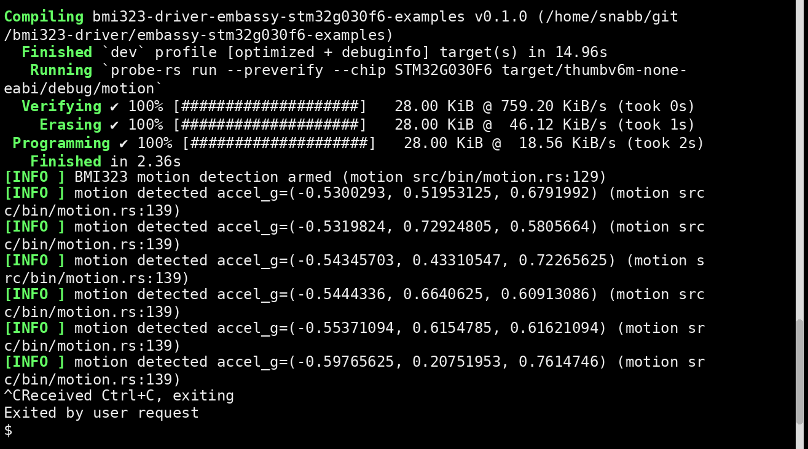

# bmi323-driver

[](https://crates.io/crates/bmi323-driver)
[](https://docs.rs/bmi323-driver)
[](https://github.com/snabb/bmi323-driver/actions/workflows/ci.yml)
[](https://github.com/snabb/bmi323-driver/blob/main/LICENSE)
[](https://www.rust-lang.org/)

`bmi323-driver` is a `no_std` Rust driver for the Bosch BMI323 6-DoF IMU.

The data sheet is available at Bosch Sensortec web site: https://www.bosch-sensortec.com/en/products/motion-sensors/imus/bmi323

This driver is designed to be transport-agnostic, small, and usable both
in generic embedded-hal applications and in async Embassy-based firmware.

`init()` performs a soft reset, so the driver starts from a known sensor state.
After `init()`, configure the accelerometer and gyroscope explicitly before
depending on sample reads. The driver does not promise application-ready accel
or gyro settings immediately after initialization.

## Features

- `embedded-hal` 1.0 blocking API support
- `embedded-hal-async` 1.0 async API support
- I2C and SPI transports
- accelerometer and gyroscope configuration
- burst accel/gyro reads
- FIFO configuration and reads
- interrupt pin electrical configuration and interrupt routing
- feature-engine enable sequence
- any-motion and no-motion configuration
- tap and orientation/flat configuration
- significant-motion and tilt configuration
- step detector and step counter support
- alternate accel/gyro configuration switching
- built-in accelerometer and gyroscope self-test

## Non-goals

This crate does not own the host MCU interrupt GPIO. The BMI323 can route
interrupts to `INT1` and `INT2`, but waiting on the external pin is left to the
application or framework:

- blocking users can poll or handle the MCU interrupt themselves, then read the
  BMI323 interrupt status register
- async users can wait on a GPIO implementing
  `embedded_hal_async::digital::Wait`, then read or consume the BMI323 interrupt
  status

This keeps the crate portable across HALs and RTOS/executor choices.

## Missing features and current limitations

This crate is usable today, but it does not yet cover the full BMI323 feature
set. In particular:

- only I2C and SPI transports are implemented; there is no I3C transport API
- FIFO support is currently low-level:
  - configuration, fill level reads, flush, and raw word reads are supported
  - higher-level FIFO frame parsing and convenience helpers are not yet provided
- there are no public helpers yet for calibration, offset compensation, or
  similar factory/service operations
- the crate has mocked transaction tests for blocking and async I2C/SPI
  transports, but it does not yet have broad transaction coverage for every
  feature combination

## Quick start

Explicit sensor configuration after `init` is expected. The `AccelConfig` and
`GyroConfig` defaults are:

- `AccelConfig::default()`: `Normal`, `Avg1`, `OdrOver2`, `G8`, `Hz50`
- `GyroConfig::default()`: `Normal`, `Avg1`, `OdrOver2`, `Dps2000`, `Hz50`

These are convenience config values only. They are not applied to the chip
unless you call `set_accel_config` and `set_gyro_config`.

For `AnyMotionConfig` and `NoMotionConfig`, the threshold, hysteresis,
duration, wait-time, and interrupt-hold fields are now documented with their
BMI323 scaling, and helper conversion functions are provided so you do not need
to work in raw field encodings directly.

### Blocking I2C

```rust,no_run
use bmi323_driver::{
    AccelConfig, AccelRange, Bmi323, GyroConfig, GyroRange, I2C_ADDRESS_PRIMARY,
    OutputDataRate,
};
use embedded_hal::delay::DelayNs;
use embedded_hal::i2c::I2c;

fn example<I2C, D>(i2c: I2C, delay: &mut D) -> Result<(), bmi323_driver::Error<I2C::Error>>
where
    I2C: I2c,
    D: DelayNs,
{
    let mut imu = Bmi323::new_i2c(i2c, I2C_ADDRESS_PRIMARY);
    imu.init(delay)?;

    imu.set_accel_config(AccelConfig {
        odr: OutputDataRate::Hz100,
        ..Default::default()
    })?;

    imu.set_gyro_config(GyroConfig {
        odr: OutputDataRate::Hz100,
        ..Default::default()
    })?;

    let sample = imu.read_imu_data()?;
    let accel_g = sample.accel.as_g(imu.accel_range());
    let gyro_dps = sample.gyro.as_dps(imu.gyro_range());
    let _ = (accel_g, gyro_dps);
    Ok(())
}
```

### Async interrupt-driven usage

```rust,no_run
use bmi323_driver::{
    AccelConfig, AccelRange, ActiveLevel, AnyMotionConfig, Bmi323Async,
    EventReportMode, I2C_ADDRESS_PRIMARY, InterruptChannel, InterruptPinConfig,
    InterruptRoute, InterruptSource, MotionAxes, OutputDataRate, OutputMode,
    ReferenceUpdate,
};
use embedded_hal_async::delay::DelayNs;
use embedded_hal_async::digital::Wait;
use embedded_hal_async::i2c::I2c;

async fn example<I2C, D, P>(
    i2c: I2C,
    delay: &mut D,
    int1_pin: &mut P,
) -> Result<(), bmi323_driver::Error<I2C::Error>>
where
    I2C: I2c,
    D: DelayNs,
    P: Wait,
{
    let mut imu = Bmi323Async::new_i2c(i2c, I2C_ADDRESS_PRIMARY);
    imu.init(delay).await?;
    imu.enable_feature_engine().await?;
    imu.set_accel_config(AccelConfig {
        mode: bmi323_driver::AccelMode::HighPerformance,
        odr: OutputDataRate::Hz100,
        ..Default::default()
    })
    .await?;
    imu.configure_any_motion(AnyMotionConfig {
        axes: MotionAxes::XYZ,
        threshold: AnyMotionConfig::threshold_from_g(0.08),
        hysteresis: AnyMotionConfig::hysteresis_from_g(0.02),
        duration: 5, // 5 / 50 s = 100 ms above threshold before event
        wait_time: 1, // 1 / 50 s = 20 ms clear delay after slope drops
        reference_update: ReferenceUpdate::EverySample,
        report_mode: EventReportMode::AllEvents,
        interrupt_hold: 3, // 0.625 ms * 2^3 = 5 ms interrupt hold
    })
    .await?;
    imu.set_interrupt_latching(true).await?;
    imu.configure_interrupt_pin(
        InterruptChannel::Int1,
        InterruptPinConfig {
            active_level: ActiveLevel::High,
            output_mode: OutputMode::PushPull,
            enabled: true,
        },
    )
    .await?;
    imu.map_interrupt(InterruptSource::AnyMotion, InterruptRoute::Int1)
        .await?;

    let status = imu
        .wait_for_interrupt(int1_pin, InterruptChannel::Int1)
        .await?;
    if status.any_motion() {
        let accel = imu.read_accel().await?;
        let _ = accel;
    }
    Ok(())
}
```

## Feature flags

- `defmt`: derives `defmt::Format` for public value types

## Repository examples

- `examples/blocking_i2c_basic.rs`
  Blocking I2C configuration and sample reads.
- `examples/async_i2c_interrupt.rs`
  Generic async interrupt-driven setup using `embedded-hal-async`.
- `examples/async_i2c_no_motion.rs`
  Generic async no-motion detection setup using `embedded-hal-async`.
- `examples/async_i2c_tap.rs`
  Generic async tap-detection setup using `embedded-hal-async`.
- `examples/async_i2c_orientation.rs`
  Generic async orientation-detection setup using `embedded-hal-async`.
- `examples/async_i2c_flat.rs`
  Generic async flat-detection setup using `embedded-hal-async`.
- `examples/async_i2c_significant_motion.rs`
  Generic async significant-motion detection setup using `embedded-hal-async`.
- `examples/async_i2c_tilt.rs`
  Generic async tilt-detection setup using `embedded-hal-async`.
- `examples/async_i2c_step_counter.rs`
  Generic async step-detector and step-counter setup using `embedded-hal-async`.
- `examples/async_i2c_alt_config.rs`
  Generic async alternate accel-configuration switching using any-motion and no-motion.
- `examples/async_i2c_self_test.rs`
  Generic async built-in accelerometer and gyroscope self-test.

Hardware-specific STM32G030F6 Embassy examples live in the separate
sub-crate [embassy-stm32g030f6-examples](./embassy-stm32g030f6-examples).

### STM32 Motion Detection Example

This screenshot shows the `embassy-stm32g030f6-examples/src/bin/motion.rs`
example running on an STM32G030F6 and printing detected accelerometer samples
after BMI323 motion interrupts fire.



## License

MIT. See [LICENSE](./LICENSE).
